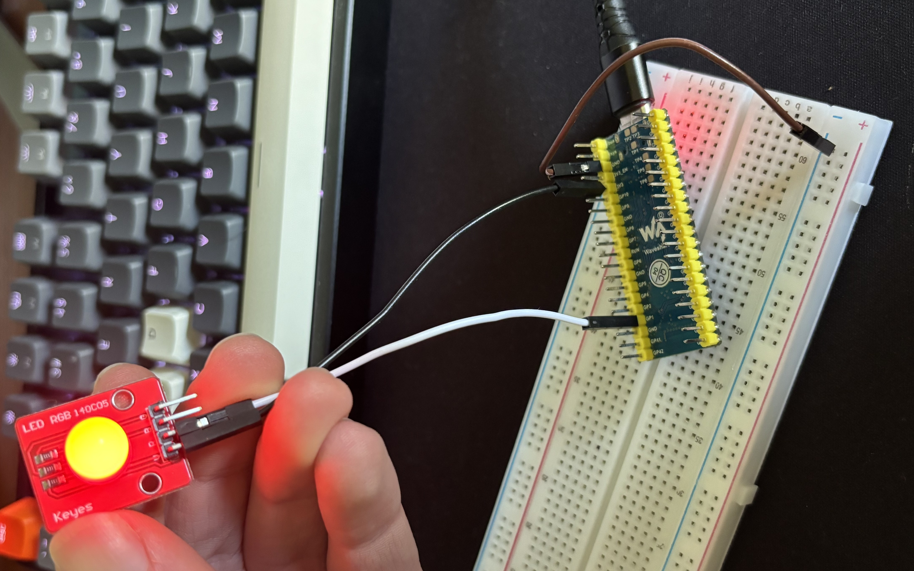
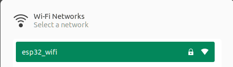
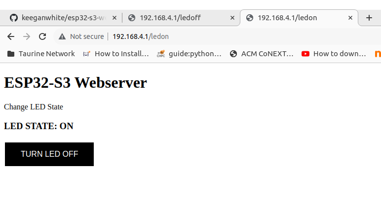
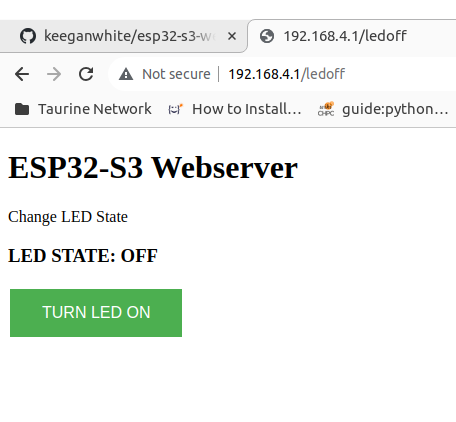

# ESP32 S3 Webserver LED
This repo contains the code to build and run an ESP32 S3 board as a webserver and control an LED.

## Part List
- [ESP32 S3 Micro Controller](https://www.pishop.co.za/store/esp32-s3-microcontroller-24-ghz-wi-fi-development-board-dual-core-processor-with-frequency-up-to-240-mhz?keyword=esp32&category_id=0)
- [Breadboard](https://www.pishop.co.za/store/830-point-solderless-breadboard?keyword=830%20Point%20Solderless%20Breadboard&category_id=0)
- [Jumper Cables](https://www.pishop.co.za/store/120pcs-20cm-color-breadboard-jumper-cable-wire-kit?keyword=jumper%20cable&category_id=0)
- [LED](https://www.pishop.co.za/store/leds/10mm-rgb-led-module)

## Demo
1. Connect the 3.3V out pin to your LED on the pin labeled 'V'.
2. Connect the group pin of the ESP32 board to the negative rail on your breadboard.
3. Connect any GPIO pin to the pin labelled by an 'R' on the LED. _I am using pin 1 in my code._
4. Power the board
5. Flash the board, full instructions [here](#running-code).
6. Connect to the WiFi network named `esp32_wifi` the board will provide with password: `password`.
7. Navigate to the web server [here](http://192.168.4.1/ledon) or [here](http://192.168.4.1/ledoff) in your browser

### Full Set Up
Full set-up described above:



### Pins
Pin layout described above:


### WiFi Network 
The WiFi network will show up like this:


### Web Page
#### LED ON STATE
The Webpage will look like this once you are connected and navigate to [http://192.168.4.1/ledon](http://192.168.4.1/ledon):

#### LED OFF STATE
The Webpage will look like this once you are connected and navigate to [http://192.168.4.1/ledoff](http://192.168.4.1/ledoff):


## Running Code
You can use the ESP IDF plugin for VS Code to easily build your code, and flash and monitor your device. However, here 
are the manual lines of code that you can run. Ensure you have your environment variables set for this to work or 
use absolute paths. [Here](example-vscode-config) is example VS Code workspace config files.
1. Clean the project: `idf.py fullclean`
2. Build the project `idf.py build`
3. Set target chip: `idf.py set-target esp32s3`
4. Flask the binary to the board: `idf.py -p <PORT> flash` where you can check the serial ports on Ubuntu: 
`sudo dmesg | grep tty`. For example: `idf.py -p /dev/ttyACM1 flash`
5. Monitor device output: `idf.py -p <PORT> monitor`

## Customisation
- In the [sdkconfig](sdkconfig) file you can change your SSID and Password in the section:
```
# Example Configuration
#
CONFIG_ESP_WIFI_SSID="esp32_wifi"
CONFIG_ESP_WIFI_PASSWORD="password"
CONFIG_ESP_WIFI_CHANNEL=1
CONFIG_ESP_MAX_STA_CONN=4
# end of Example Configuration
```
